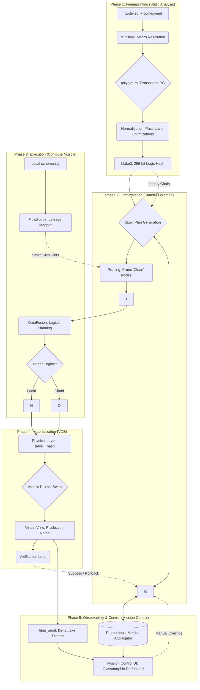

Titan Engine: Refined Technical Architecture Specification

1. Core Architectural Philosophy: The "Serialized Pipe"
To ensure 99.9% portability with dbt/SQLMesh logic without the brittleness of custom unified ASTs, Titan adopts PostgreSQL-dialect SQL strings as its internal Lingua Franca.
Bypassing the AST Trap: polyglot-rs, DataFusion, and flowscope-core frequently depend on incompatible versions of sqlparser-rs (e.g., v0.61 vs v0.50). Passing AST objects across these boundaries triggers "Type Mismatch" errors and requires forking dependencies. Titan resolves this by serializing to a canonical SQL string at every module boundary.
Pivot Dialect Selection: PostgreSQL is the authoring standard. It allows the use of rich features (window functions, :: casting, JSON operators) that polyglot-sql can "downgrade" or transpile to warehouse-specific DDL/DML.
Performance Overhead: sqlparser-rs parses 1,000 statements in ~13ms. For a 10,000-model project, the cumulative re-parsing cost is <200ms, which is orders of magnitude faster than Python-based parsing in dbt-core or SQLMesh.

2. Static Analysis: The Semantic Fingerprinter
The goal is to generate a Blake3 hash that represents a model’s semantic identity, invariant under stylistic changes.

2.1 Template Rendering (minijinja)
Logic: Implement a Rust Environment with dbt-compatible globals: ref(), source(), var(), and is_incremental().
Configuration: Enable preserve_order(true) to ensure deterministic SELECT list generation and UndefinedBehavior::Strict to fail immediately on missing variables.
Speed: MiniJinja’s stack-based VM evaluates macros up to 30x faster than Python Jinja2.

2.2 Normalization & Transpilation (polyglot-sql)
Normalization Pass: Use polyglot_sql::optimizer to perform constant folding and alias standardization before hashing.
Dialect Parity: Map dialect-specific functions (e.g., IFNULL in MySQL to COALESCE in Postgres) to ensure logic authored in different dialects results in the same fingerprint.
Guard Rails: Apply FormatGuardOptions (e.g., 16MiB input limit, 1M AST node limit) to prevent memory exhaustion on pathological SQL inputs.

2.3 Cryptographic Hashing (blake3)
Composition: The hash is a concatenation of the Normalized SQL String + Serialized Config + Hashes of all parent models in the DAG.
Mechanism: Use the Hasher::new() incremental API to process large inputs in parallel across SIMD lanes.

3. Stateful Orchestration: The Filler
The "Filler" manages the execution lifecycle, performing "Smart Skips" by comparing fingerprints against local state.

3.1 Local State Store (RocksDB + sov-schema-db)
Type Safety: Use the define_schema! macro to enforce Rust types over RocksDB’s raw bytes.
WiscKey Pattern: Store small metadata (hashes, status) in the main LSM-tree and large values (full SQL bodies, schema JSONs) in an append-only value log (vlog_db) to prevent write amplification during compaction.
Inverted Commit Strategy: Commit the fingerprint and "Intent-to-Apply" to RocksDB immediately before the warehouse pointer swap. If the swap fails, Titan retries only the atomic O(1) DDL operation on the next run, preventing costly re-materialization.

3.2 Plan Generation & Parallelism (dagx)
Foreman Logic: dagx provides Compile-Time Cycle Prevention through the type-state pattern.
Parallel Dispatch: Tasks are managed by the Tokio runtime. Use semaphores to cap concurrent warehouse connections to avoid API throttling.
Pruning: Node execution is skipped if the logic hash matches state OR if flowscope-core confirms additive column changes that are not consumed by downstream models.

4. Vectorized Execution: The Muscle
Titan uses DataFusion for local compute and as a coordinator for remote warehouses.

4.1 Federated Connectivity (Spice.ai)
Connector Reference: Leverage the 20+ production-ready connectors from the spice.ai project for Snowflake/BigQuery pushdown support.
Planning Safety: Strictly isolate network I/O from the TableProvider::scan() phase. Discovery must occur within the asynchronous stream to prevent "Planning Deadlocks" where metadata fetching blocks the planner thread pool.

4.2 Handling Structural Divergence
Problem: Some constructs (e.g., UNNEST in BigQuery vs. LATERAL FLATTEN in Snowflake) require fundamental structural rewrites that string-replace cannot handle.
Solution: Hook into DataFusion’s RelationPlanner. Rewrite these LogicalPlan nodes into the target’s specific relational pattern before unparsing back to a SQL string.

5. Deep Lineage: The Mapper (flowscope-core)
Titan provides column-level lineage to enable granular impact analysis.
Offline Wildcard Resolution: Resolve SELECT * without an active database connection by loading a project-local schema.sql file. flowscope-core uses this DDL to perform wildcard expansion offline.
Backward Inference: Track column dependencies through nested CTEs and subqueries to find the true root source.

Technical Architecture & Interconnected Activities

Final Guardrails for "Three 9s" Portability
Type Parity Verification: Use Arrow Extension Types to propagate high-precision warehouse types (e.g., BigQuery BIGNUMERIC) through the execution pipeline to prevent silent truncation.
Incremental Idempotency: Favor INSERT OVERWRITE partition logic over row-level MERGE wherever supported. Partition swaps are inherently atomic and resilient to mid-run crashes.
Post-DDL Verification Loop: Query the warehouse INFORMATION_SCHEMA immediately after a pointer swap to confirm the view definition matches the RocksDB state before finalizing the plan application.
Identifier Qualification: Ensure all DDL generation uses dialect-aware quoting (e.g., double quotes for Postgres/Snowflake, backticks for BigQuery) to prevent failures on schema names with special characters.

Summary for Implementation: The engine boundary is the SQL string. By reparsing at each stage, the implementation avoids the "AST Version Trap" while maintaining sub-millisecond local latency. dagx acts as the Foreman directing Tokio workers to call DataFusion (the Muscle) and flowscope-core (the Mapper).
